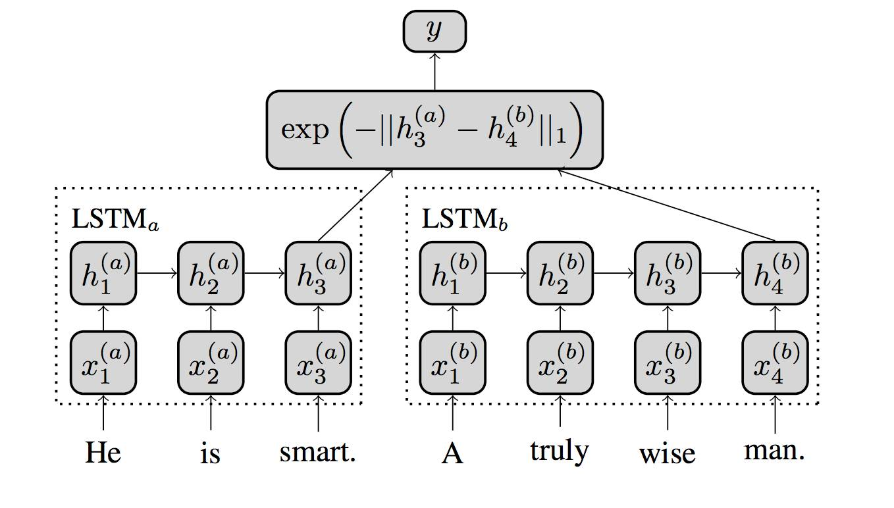

# 中文短句子相似度

受论文: 

<a href = "http://www.mit.edu/~jonasm/info/MuellerThyagarajan_AAAI16.pdf">Mueller, Jonas, and Aditya Thyagarajan. "Siamese Recurrent Architectures for Learning Sentence Similarity." AAAI. 2016.</a>

和英文代码：<a href = "https://github.com/hncpr1992/tensorflow_siamese_lstm">tensorflow_siamese_lstm.</a>的启发

The structure of Siamese_LSTM is like

已经在github上找到的中文数据集 貌似关于金融方面的问题对

数据集的格式要三项

q1

q2

q1和q2是否相似的判断 的0或1

数据集中我也只用这三项 其他没用

我训练集是大概2k多条

迭代了一百次在测试集上准确度到达90%

